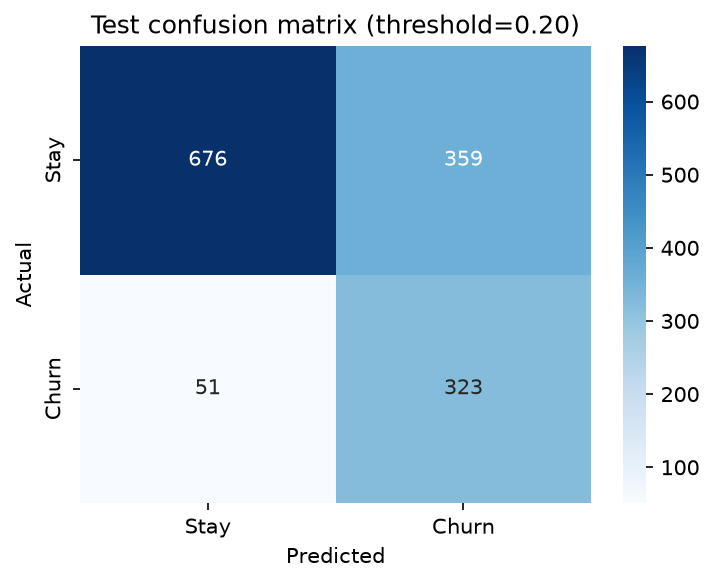
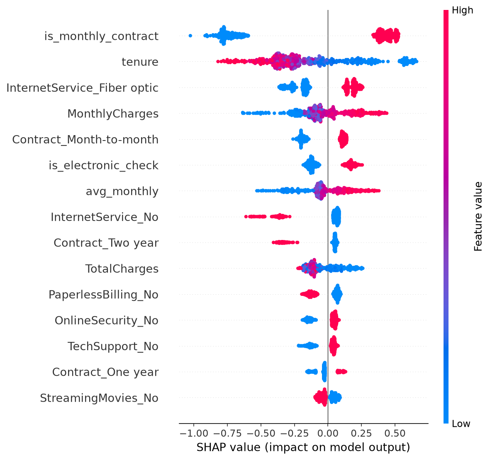
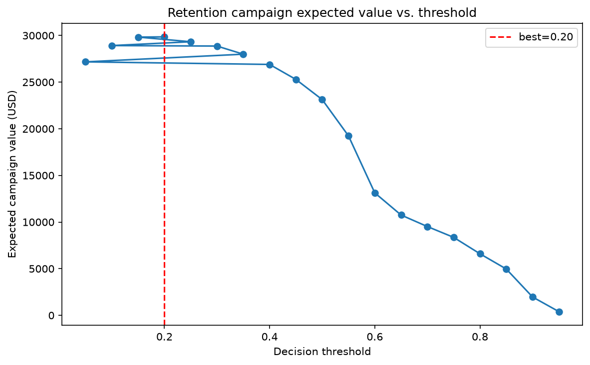
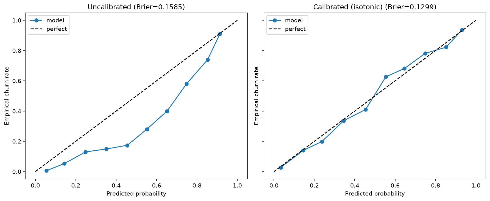

# Customer Churn Prediction — End-to-End ML with Deployment

An end-to-end churn project that proves the full loop: **business framing → rigorous
modeling → calibrated probabilities → cost-based decisions → shipped API**.
Built on the real IBM Telco Customer Churn dataset (7,043 customers).



## Problem statement

A telecom operator loses ~26.5% of its customers. Blanket retention offers waste
money; doing nothing loses revenue. The business question: **which customers should
receive a retention offer, and is the campaign worth running at all?**

This project answers it with a calibrated churn model plus an explicit
retention-economics model (offer cost, save rate, customer lifetime value) that
turns the decision threshold into a business decision — not an arbitrary 0.5.

## Methodology

- **Data.** IBM Telco Customer Churn (7,043 rows), fetched from the public IBM repo.
  Handled quirks explicitly: 11 blank `TotalCharges` values (tenure-0 customers →
  median imputation), `"No phone/internet service"` normalization, `customerID` dropped.
- **Feature engineering.** Tenure buckets (churn is non-linear in tenure), `avg_monthly`
  charges, add-on service count, new-customer / month-to-month / electronic-check flags,
  49 features after one-hot encoding. Full story in `src/churn/features.py`.
- **Models.** Logistic regression vs. random forest vs. XGBoost vs. LightGBM —
  stratified 5-fold CV with proper scoring (ROC-AUC, PR-AUC, log-loss); class imbalance
  handled via `class_weight` / `scale_pos_weight` (≈2.77:1).
- **Tuning.** Optuna (TPE sampler + median pruning, seeded) for both boosters —
  chosen over random search because it concentrates budget on promising regions.
- **Calibration.** Isotonic calibration of the champion; reliability diagrams before/after
  (probabilities must mean what they say before they drive money decisions).
- **Decision rule.** Threshold chosen to maximize expected campaign value on validation:
  EV = p(churn)·save_rate·(6×MonthlyCharges) − $20 offer cost, with a 30% save-rate
  assumption — all stated explicitly in `src/churn/evaluation.py`.
- **Explainability.** SHAP summary + dependence plots.
- **Tracking & serving.** MLflow (SQLite backend) for experiments; FastAPI service
  (`POST /predict`, `POST /predict/batch`, `GET /health`) with pydantic validation;
  Dockerfile for containerized serving.

## Results

All numbers from `scripts/run_analysis.py` (seed 42); full record in `results/metrics.json`.

**5-fold CV on train (default hyperparameters):**

| Model | ROC-AUC | PR-AUC | F1 |
|---|---|---|---|
| Logistic regression | 0.8444 | 0.6622 | 0.6183 |
| XGBoost | 0.8373 | 0.6493 | 0.6242 |
| LightGBM | 0.8309 | 0.6401 | 0.6007 |
| Random forest | 0.8299 | 0.6314 | 0.5543 |

**After Optuna tuning (25 trials, 3-fold CV):** XGBoost 0.8458, LightGBM 0.8412.

**Validation (20% holdout):**

| Model | ROC-AUC | PR-AUC | F1 | Brier |
|---|---|---|---|---|
| **XGBoost tuned (champion)** | **0.8613** | **0.6847** | 0.6452 | 0.1585 |
| LightGBM tuned | 0.8588 | 0.6796 | 0.6482 | 0.1560 |
| Logistic regression | 0.8590 | 0.6736 | 0.6354 | 0.1622 |
| Random forest | 0.8378 | 0.6335 | 0.5697 | 0.1394 |

Honest note: logistic regression is remarkably competitive here (0.8590 vs. 0.8613) —
on this dataset, good features beat fancy models. XGBoost wins on ROC-AUC/PR-AUC and
becomes the champion after isotonic calibration.

**Test set (touched once, threshold 0.20 from validation):**

| Metric | Value |
|---|---|
| ROC-AUC | 0.8365 |
| PR-AUC | 0.6408 |
| F1 | 0.6117 |
| Expected campaign value | **$30,414** |

**Business outcome:** at the optimal threshold (0.20), the model recommends contacting
699 validation customers with an expected campaign value of **$29,854** on validation
and **$30,414** on the held-out test set — the campaign is worth running, and the
threshold is far from the naive 0.5.

**Top churn drivers (SHAP):** month-to-month contract, tenure, fiber-optic internet,
monthly charges — consistent with the EDA: new customers on expensive
month-to-month fiber plans churn most.





## Quickstart

```bash
python3 -m venv .venv && .venv/bin/pip install -r requirements.txt
.venv/bin/python scripts/run_analysis.py   # full pipeline -> results/, models/champion.pkl
.venv/bin/python -m pytest -q              # 20 tests
```

**Serve the API:**
```bash
CHURN_MODEL_PATH=models/champion.pkl .venv/bin/uvicorn churn.api:app --app-dir src --port 8000
curl -X POST localhost:8000/predict -H "Content-Type: application/json" -d @- <<'EOF'
{"gender":"Female","SeniorCitizen":0,"Partner":"Yes","Dependents":"No","tenure":1,
 "PhoneService":"No","MultipleLines":"No phone service","InternetService":"DSL",
 "OnlineSecurity":"No","OnlineBackup":"Yes","DeviceProtection":"No","TechSupport":"No",
 "StreamingTV":"No","StreamingMovies":"No","Contract":"Month-to-month",
 "PaperlessBilling":"Yes","PaymentMethod":"Electronic check",
 "MonthlyCharges":29.85,"TotalCharges":29.85}
EOF
```

**Docker** (written carefully; not build-tested — no Docker daemon in this environment):
```bash
docker build -t churn-api .
docker run -p 8000:8000 churn-api
```

**MLflow UI:**
```bash
.venv/bin/mlflow ui --backend-store-uri sqlite:///mlruns.db
```
MLflow tracks all experiment params/metrics (SQLite backend). Note: MLflow 3.x
refuses to serialize the calibrated XGBoost bundle as a model artifact (skops
trusted-types policy for `CalibratedClassifierCV` internals), so the artifact of
record is the committed `models/champion.pkl` — logged params/metrics are unaffected.

## Project structure

```
├── src/churn/          # package: features, models, tuning, calibration,
│                       #            evaluation, explain, api
├── scripts/run_analysis.py   # end-to-end pipeline (EDA -> champion bundle)
├── data/               # download.py + README (dataset docs)
├── tests/              # 20 pytest tests (features, models, calibration, API)
├── docs/math_notes.md  # derivations: logistic loss, boosting, calibration, EV rule
├── results/            # metrics.json + figures (committed)
├── models/champion.pkl # calibrated champion + preprocessor + threshold (committed)
├── Dockerfile          # serves the FastAPI app
├── mlruns.db           # MLflow tracking (SQLite, git-ignored; regenerate via script)
└── .github/workflows/ci.yml
```

## Reproducibility

- Fixed seed (42) for splits, CV, Optuna (TPE sampler), SHAP subsampling, and calibration.
- Pinned `requirements.txt` (verified on Python 3.12).
- Test set touched exactly once, after all decisions were frozen on validation.
- One command reproduces everything: `scripts/run_analysis.py`.

## Limitations & future work

- **Single dataset, single geography/time** — the Telco dataset is from one operator;
  thresholds and feature effects may not transfer. Needs re-validation per market.
- **Business parameters are assumptions** ($20 offer cost, 30% save rate, 6-month LTV).
  The framework is the deliverable; a real deployment must estimate these from
  historical campaign data (uplift modeling would be the next step).
- **No temporal validation** — the data has no time column, so the split is random,
  not time-based; churn dynamics may drift.
- **Class imbalance is mild** (26.5%); techniques here may need strengthening at 1–5%.
- **Dockerfile not build-tested** (no Docker in this sandbox) — verify before claiming
  production readiness.
- Future: uplift modeling for offer targeting, drift monitoring on live scores,
  Fairness audit across senior-citizen / gender segments.

## References

- IBM Telco Customer Churn dataset (public IBM repo).
- Chen & Guestrin (2016). XGBoost: A scalable tree boosting system.
- Niculescu-Mizil & Caruana (2005). Predicting good probabilities with supervised learning.
- Lundberg & Lee (2017). A unified approach to interpreting model predictions (SHAP).
